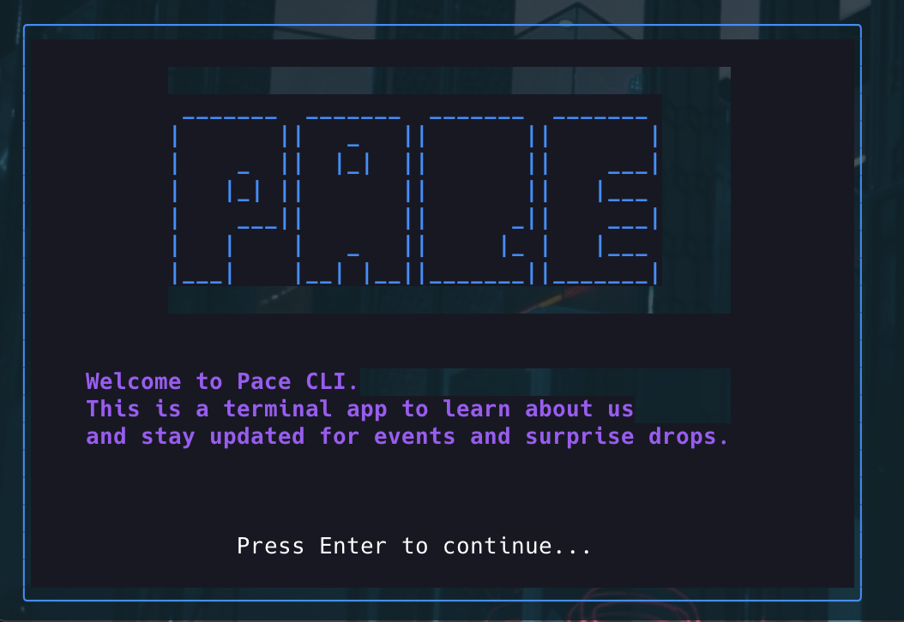

# Pace CLI



Welcome to the **Pace CLI**.

> "Hey! Only real G found their way here."

---

A CLI tool for Pace Capital announcements and updates, accessible both locally and over SSH.

## Installation

### Quick Install (Recommended)

**One-line installer for macOS/Linux:**
```bash
curl -fsSL https://raw.githubusercontent.com/fakepixels/pace/main/install.sh | bash
```

### Package Managers

**Homebrew (macOS/Linux):**
```bash
brew install fakepixels/tap/pace
```

**Go Install:**
```bash
go install github.com/fakepixels/pace@latest
```

### Manual Installation

**Download Pre-built Binaries:**

1. Visit the [releases page](https://github.com/fakepixels/pace/releases/latest)
2. Download the archive for your operating system
3. Extract and install:
   ```bash
   # macOS/Linux:
   tar xzf pace_*_*.tar.gz
   sudo mv pace /usr/local/bin/

   # Windows:
   # Extract the .zip file and move pace.exe to your PATH
   ```

**Build from Source:**

Requirements: [Go 1.24.4+](https://golang.org/dl/)

```bash
git clone https://github.com/fakepixels/pace.git
cd pace
make build
sudo make install
```

## Usage

The Pace CLI can be run in two modes:

### 1. Local Mode (Default)

For a quick, local experience, simply run the command:
```bash
pace
```
This will launch the application directly in your current terminal session.

Navigate through the menu using:
- ↑/↓ or k/j to move
- Enter to select
- b to go back
- q to quit

### 2. SSH Server Mode

To run the app as a secure SSH server that others can connect to, use the `--serve` flag:
```bash
pace --serve
```
This will start an SSH server. You can then connect to it from another terminal window:
```bash
ssh localhost -p 23234
```
The first time you start the server, it will automatically generate and save an SSH key in a `.ssh` directory. This key is used to secure the connection.

## Features

- Run as a local TUI or a secure, shareable SSH server
- Read announcement posts
- Send a hello email to Tina
- Discover random Substack posts
- Visit [Pace Desktop](https://desktop.pacecapital.com/)
- Secret drops, events, swag

## 🌐 Announcement Site

Check out the full announcement online:

👉 [pace-announcement.vercel.app](https://pace-announcement.vercel.app/)

---

## 🛠️ Development

**Quick Setup:**
```bash
git clone https://github.com/fakepixels/pace.git
cd pace
make setup
make dev
```

**Available Commands:**
- `make dev` - Run in development mode
- `make build` - Build binary
- `make test` - Run tests
- `make install` - Install locally
- `make help` - Show all commands

See [CONTRIBUTING.md](CONTRIBUTING.md) for detailed development guidelines.

## 💡 About

Pace CLI is a playful, artful terminal app for the Pace community, built with 💙 using [Bubble Tea](https://github.com/charmbracelet/bubbletea), [Lip Gloss](https://github.com/charmbracelet/lipgloss), [Glamour](https://github.com/charmbracelet/glamour), and [Wish](https://github.com/charmbracelet/wish).

---

Made by [Tina](https://x.com/fkpxls).